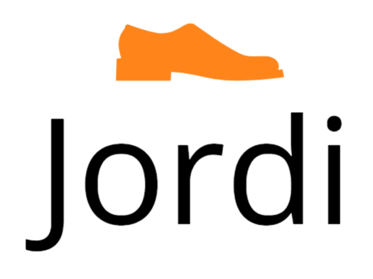

👟 JORDI: THE ULTIMATE FOOTWEAR DESTINATION 👟
Step Into Style — Engineered for the Modern Explorer 
🌐 EXPLORE LIVE DEMO

🌟 OVERVIEW 
Jordi is a premium, high-performance eCommerce experience designed to bridge the gap between high-fashion aesthetics and technical functionality. Whether you are looking for the latest athletic tech or casual summer comfort, Jordi provides an immersive, fully responsive storefront optimized for every screen.

🎨 PREVIEW 
"New Summer Shoes Collection" 

⚡ CORE FEATURES 
🏆 Brand Supremacy:  Seamlessly browse specialized collections from global giants like Nike, Adidas, Puma, Bata, and Apex.

📱 Masterful Responsiveness:  A mobile-first design featuring a sleek sidebar navigation and a dynamic "Top" scroll functionality.

🛍️ Premium Shopping Kit:  Complete with a real-time wishlist, interactive shopping basket, and "Quick View" capabilities for every product.

💳 Secure & Swift:  Built-in modules for 100% secure payments, free shipping on orders over $150, and a 30-day money-back guarantee.

💌 Smart Engagement:  Integrated newsletter subscription and 24/7 customer support access.

🛠️ THE TECH STACK 
HTML5: Semantic structure for robust SEO.

CSS3: Custom styles including preloaded banners and custom-built scrollbars.

JavaScript: Powering the interactive navigation and dynamic product filtering.

Ionicons: High-definition vector icons for a crisp visual interface.

🚀 GETTING STARTED 
Clone the repository and launch your store in seconds: 

Bash 

# Clone the masterpiece 
git clone https://github.com/tallalmirza04/jordi.git

# Enter the directory 
cd jordi

# Open the experience 
open index.html 
 
 
 
📞 CONNECT WITH THE DEVELOPER 

👤 Lead Architect: Tallal Mirza

📧 Email: tallalmirza65@gmail.com

📍 Location: Islamabad, Pakistan

 
🛡️ LICENSE & COPYRIGHT 
This project is Open Source and free for community use.
 
© 2024 Tallal Mirza. All Rights Reserved.
